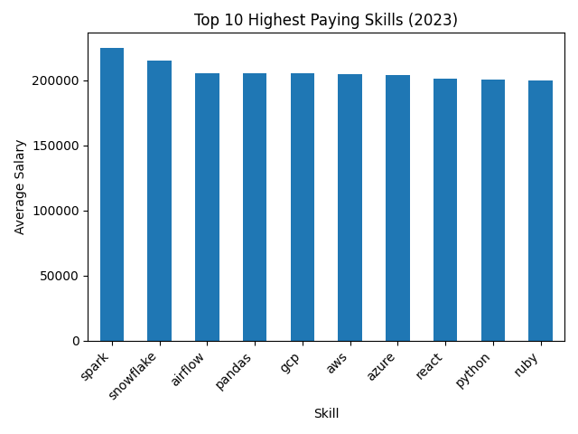

# SQL Project: Job Data Analysis

## 📌 Overview

This project analyzes **software engineering job postings data** using SQL to uncover insights about **top-paying roles**, **in-demand skills**, and **salary trends**. The goal is to demonstrate practical SQL skills—data modeling, joins, aggregations, and analysis—while answering real-world career and market questions.

The project focuses on identifying:

* The highest-paying software engineering jobs
* Skills most commonly associated with top salaries
* Demand vs. compensation trade-offs for technical skills

This repository is well-suited for showcasing SQL proficiency to recruiters, hiring managers, or as part of a data / analytics portfolio.

---

## 🗂️ Project Structure

```
SQL_Project_Job_Data/
│
├── sql_load/
│   ├── *.sql        # Scripts to create tables and load raw job data
│
├── project_sql/
│   ├── *.sql        # Analytical SQL queries answering business questions
│
└── README.md
```

### Folder Descriptions

#### `sql_load/`

Contains SQL scripts used to:

* Create database tables
* Define schemas
* Load job posting data into the database

These scripts are intended to be run first.

#### `project_sql/`

Contains SQL queries used for **analysis**, including:

* Top-paying software engineering roles
* Skills associated with high salaries
* Skill frequency and demand
* Salary aggregation by skill

---

## 🛠️ Tools & Technologies

* **SQL** (PostgreSQL / SQLite compatible)
* Relational database concepts
* Job postings dataset (software engineering roles)

Optional (for visualization):

* Python (Pandas, Matplotlib)
* Excel / Tableau / Power BI

---

## 📊 Key Questions Answered

This project explores questions such as:

* What are the **highest-paying software engineering jobs**?
* Which **technical skills** appear most often in top-paying roles?
* How does **skill demand** compare to salary potential?
* Which skills provide the **best return on learning investment**?

---

## 🚀 How to Run the Project

1. **Clone the repository**

   ```bash
   git clone https://github.com/MichaliMavromatis/SQL_Project_Job_Data.git
   ```

2. **Create a database** (PostgreSQL or SQLite)

3. **Run the scripts in `sql_load/`**

   * Create tables
   * Load the job data

4. **Run analytical queries in `project_sql/`**

   * Explore salaries, skills, and job trends

5. *(Optional)* Export query results for visualization

---

## 📊 Visual Insights

### 🔥 Most In-Demand Skills

This chart shows which skills appear most frequently across job postings, indicating strong market demand.


### 💰 Highest Paying Skills

This chart highlights the skills associated with the highest average salaries.



> 📌 **Note:** Salary-based insights are averages across postings and may vary by seniority, company, and region.

---

## 📈 Example Insights

Some typical insights derived from this analysis include:

* Cloud platforms (AWS, Azure, GCP) are strongly correlated with higher salaries
* Python consistently appears in top-paying roles
* Data engineering and backend-focused skills command higher pay than generalist roles

---

## 🎯 Project Purpose

This project was built to:

* Demonstrate real-world SQL analytics skills
* Practice working with normalized relational datasets
* Translate raw data into meaningful career insights

It can be extended with:

* Visual dashboards
* Additional datasets (e.g., 2024–2025 job data)
* Advanced SQL (CTEs, window functions)

---

## 📬 Contact

If you have feedback or suggestions, feel free to connect or open an issue.

Happy querying! 🚀
